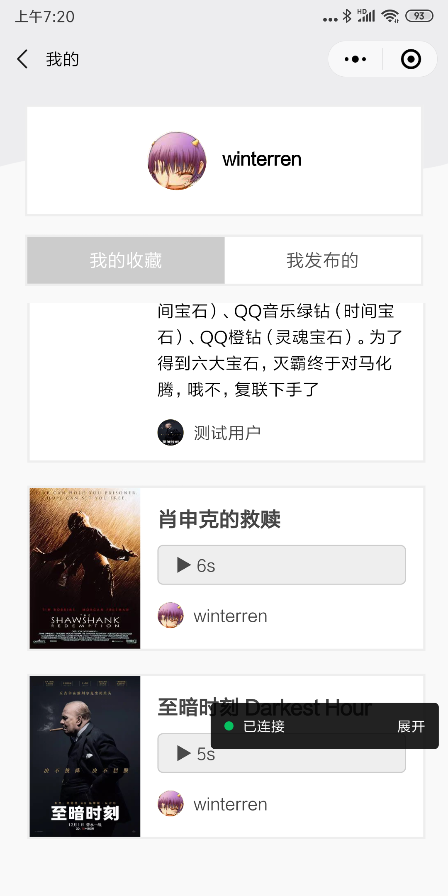

# wmp-movie

### Udacity课程2--看看侃侃电影

### 项目简介

本项目为Udacity微信小程序纳米学位课程2项目--看看侃侃电影。主要功能包括推荐电影影评，电影列表和详情，编辑、收藏、影评， 影评列表和详情，查看收藏和发布的影评列表。

### 运行环境说明

由于本项目为学习项目，后台服务为`腾讯云微信小程序开发环境`，故在手机端需打开`调试模式`。

## 后端
数据库相关表可执行项目中的[movie.sql](src/movie.sql)导入

#### 数据字典

##### 电影信息 movie

| 中文          | 字段名      | 类型     | 说明                                |
| ------------- | ----------- | -------- | ----------------------------------- |
| ID            | id          | int(11) | 自增主键                            |
| 标题        | title       | varchar(255) |                |
| 图片url   | image       | varchar(255) |                                     |
| 标签        | category    | varchar(255) |                                     |
| 简介    | description | text |                                     |
| 记录生成事件 | create_time | decimal  | 自动生成         |

##### 影评信息 m_comment

| 中文          | 字段名      | 类型         | 说明                          |
| ------------- | ----------- | ------------ | ----------------------------- |
| 评论ID        | comment_id   | int(11)      | 自增主键                      |
| 电影ID        | id           | int(11)      | 与movie表进行关联的id         |
| 用户ID        | user        | varchar(255) |                               |
| 用户名        | username   | varchar(255)  |                               |
| 用户头像      | avatar     | varchar(255)  |                               |
| 影评类型      | type        | varchar(10)  | 文字：'0'; 音频: '1'         |
| 影评内容或url | content     | Text         | 文字: 评论内容，音频: 存储url |
| 音频时长      | duration    | int(5)       |                               |
| 记录生成时间  | create_time | datetime     | 自动生成                      |

##### 收藏信息 m_favourate

| 中文          | 字段名      | 类型     | 说明                                |
| ------------- | ----------- | -------- | ----------------------------------- |
| 用户ID        | user_id     | varchar2 |                                     |
| 影评ID        | comment_id  | decimal  | 与comment表进行关联的id             |
| 记录生成时间  | create_time | datetime | 自动生成                            |

### 接口列表

~~~javascript
// 获得电影
router.get('/movie', controllers.movie.movie)
// 获得指定电影详情
router.get('/movie/:id', controllers.movie.detail)
// 获得评论
router.get('/comment/:id', controllers.comment.comment)
// 获得指定评论详情
router.get('/commentdetail/:id', controllers.comment.commentdetail)
// 获得随机评论
router.get('/randomcomment', controllers.comment.randomcomment)
// 添加评论
router.put('/addcomment', validationMiddleware, controllers.comment.add)
// 获得收藏
router.get('/favourite/:id', controllers.favourite.favourite)
// 检查收藏、添加收藏、删除收藏
router.get('/checkfavourite/:id', validationMiddleware,  controllers.favourite.check)
router.put('/addfavourite/', validationMiddleware, controllers.favourite.add)
router.post('/delfavourite/', validationMiddleware, controllers.favourite.del)
~~~

## 前端

#### 界面与交互

##### 页面

应用至少拥有以下页面：首页，电影列表页，电影详情页，影评列表页，影评详情页，影评编辑页，影评预览页，个人中心页。

##### 首页

随机展示当前热门电影的某一条影评。海报图需跳转至电影详情页；点击 "XX给你推荐了一部电影" 可跳转至该推荐人对此影片的影评详情页；首页还应包含两个按钮，分别跳转至电影列表页和个人中心页。

##### 电影列表页

点击每部电影能够跳转到对应的电影详情页。

##### 电影详情页

包含两个按钮，一个点击后跳转至该电影的影评列表页，另一个点击后弹出底部菜单，可让用户选择添加文字影评还是语音影评。

##### 影评列表页

根据影评类型展示不同UI，当类型为文字时，截取影评部分文字信息做展示；当类型为语音时，展示语音图标以示区分。点击每条影评能够跳转到对应的影评详情页。

##### 影评详情页

点击 "收藏" 按钮可收藏该条影评。除此之外还应有一个按钮，当用户没有评价过此影片时，点击此按钮弹出底部菜单，可让用户选择添加文字影评还是语音影评；当用户评价过此影片时，点击此按钮能够跳转到用户对此影片的影评详情页。

##### 影评编辑页

根据用户想要添加的影评类型展示相应的编辑界面。类型为文字影评时，用户只能编写文字影评；类型为语音影评时，用户只能录入语音影评。

##### 影评预览页

展示用户即将发布的影评内容。包含两个按钮，一个按钮可返回编辑页重新编辑；一个按钮可发布该条影评并跳转至该电影的影评列表。

##### 个人中心页

用户可选择查看 "已收藏的" 影评列表和 "已发布的" 影评列表。点击列表项后能够跳转到对应影评详情。页面有一个按钮可点击后返回首页。

#### 界面截图

